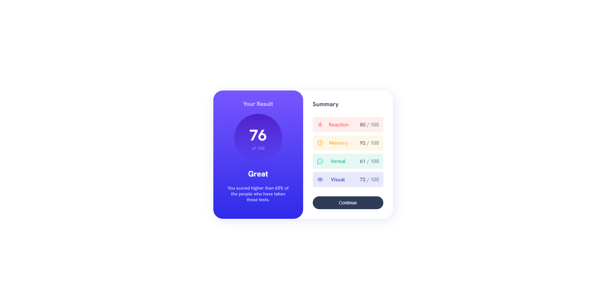

# Frontend Mentor - Results summary component solution

This is a solution to the [Results summary component challenge on Frontend Mentor](https://www.frontendmentor.io/challenges/results-summary-component-CE_K6s0maV). Frontend Mentor challenges help you improve your coding skills by building realistic projects. 

## Table of contents

- [Overview](#overview)
  - [The challenge](#the-challenge)
  - [Screenshot](#screenshot)
  - [Links](#links)
- [My process](#my-process)
  - [Built with](#built-with)
  - [What I learned](#what-i-learned)
  - [Continued development](#continued-development)
- [Author](#author)
- [Acknowledgments](#acknowledgments)

## Overview

### The challenge

Users should be able to:

- View the optimal layout for the interface depending on their device's screen size
- See hover and focus states for all interactive elements on the page

### Screenshot



### Links

- Solution URL: [https://www.frontendmentor.io/solutions/results-summary-component-I4PiUqkaCH](https://www.frontendmentor.io/solutions/results-summary-component-I4PiUqkaCH)
- Live Site URL: [https://lucassilvaaraujo.github.io/results-summary-component-main/](https://lucassilvaaraujo.github.io/results-summary-component-main/)

## My process

### Built with

- Semantic HTML5 markup
- CSS custom properties
- Flexbox
- CSS Grid

### What I learned

In this project I learned how to use the "<span>" tag, yes, I'm a newbie XD. But I'm proud of it, everyone should start it from somewhere right? Look beyond some parts that I used.

```html
      <section class="score">
        <h1 class="titulo_resultado">Your Result</h1>
        <h2 class="nota">76 <span>of 100</span></h2>
        <h3 class="nota_descritivo">Great</h3>
        <p class="descricao">You scored higher than 65% of the people who have taken these tests.</p>
      </section>

        <ul class="summary_itens">
          <li class="reaction">Reaction<span> </span><span><b>80</b> / 100</span></li>
          <li class="memory">Memory<span> </span><span><b>92</b> / 100</span></li>
          <li class="verbal">Verbal<span> </span><span><b>61</b> / 100</span></li>
          <li class="visual">Visual<span> </span><span><b>72</b> / 100</span></li>
        </ul>
```
```css
.results_summary_component .score span {
    font-size: 14px;
    color: hsl(241, 100%, 89%, 0.4);
}

.summary .summary_itens span {
    color: hsl(224, 30%, 27%, 0.7);
}
```

### Continued development

It's on my planning to do some improvements to look better and most similar with the example. The spacing between the words from the right part it's one thing that I need to improve, don't really now how to do this for now but gonna change very soon.

## Author

- Website - [Lucas Araújo](https://lucassilvaaraujo.github.io/portfolio/)
- Frontend Mentor - [@LucasSilvaAraujo](https://www.frontendmentor.io/profile/LucasSilvaAraujo)
- Twitter - [@shalkzera](https://instagram.com/shalkzera)

## Acknowledgments

I wanna give some thanks to [@LaissonBruno](https://github.com/laissonbruno) that help me alot in this project.
